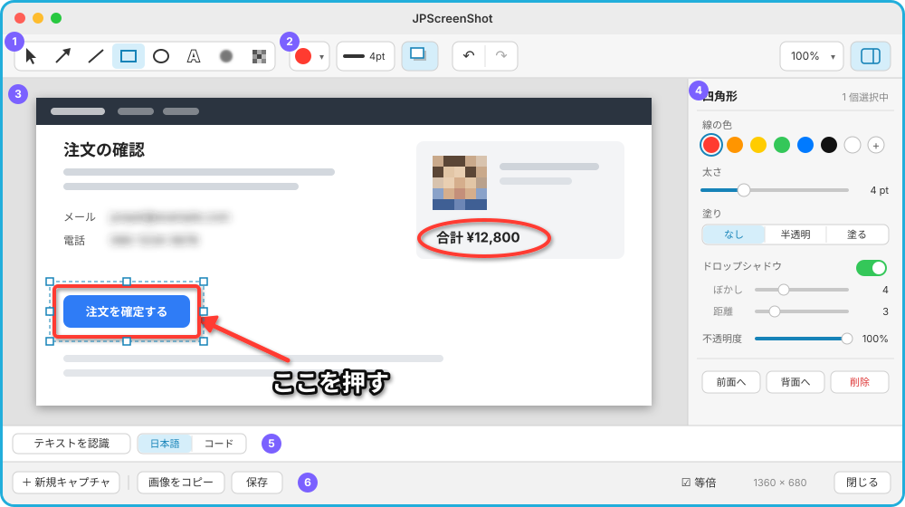
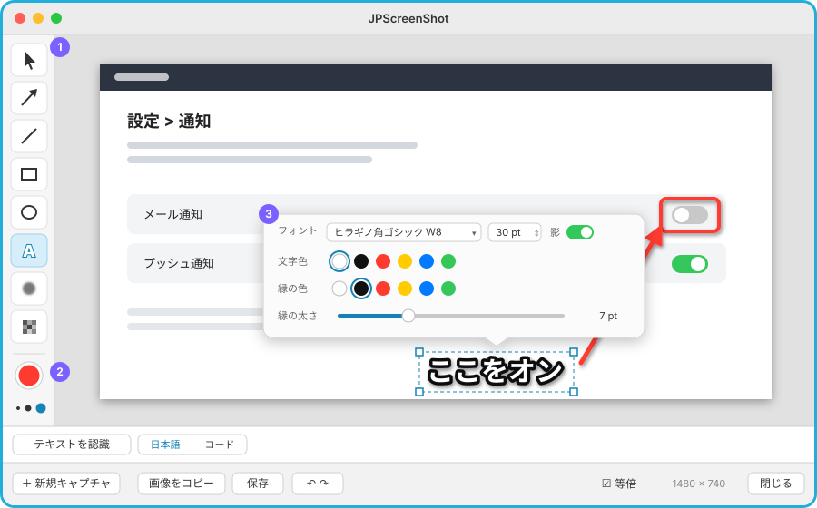
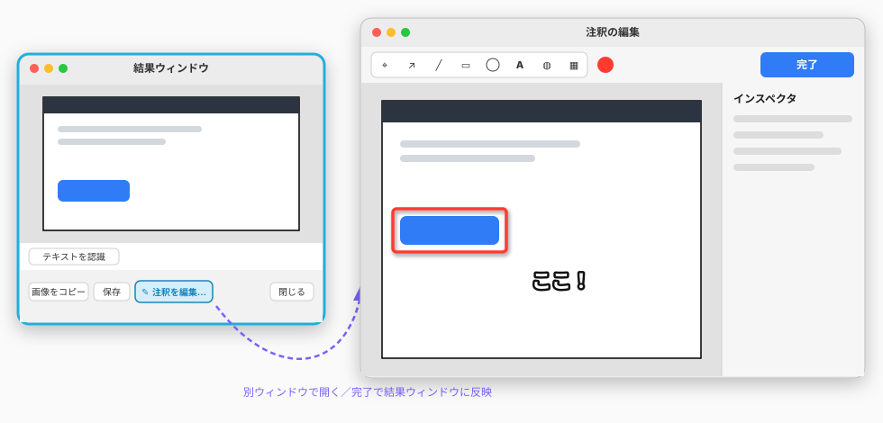
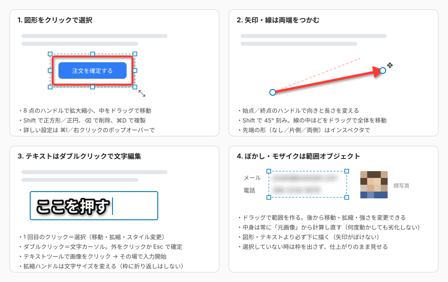
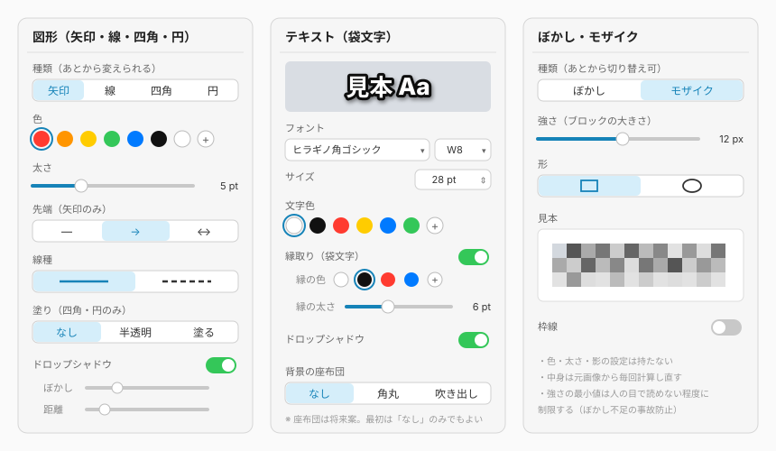

# 注釈編集機能 画面構成案

撮ったスクリーンショットに矢印・線・四角・円・テキスト（袋文字）・ぼかし・モザイクを描き込み、**後からクリックして編集し直せる**（ベクトル）機能の画面構成案。Skitch と同じ系統の機能を、今の結果ウィンドウに組み込む前提で検討する。

## 決定事項（2026-10-07）

| 論点 | 決定 |
|---|---|
| 画面構成 | **案B（Skitch 風・左の縦ツールレール＋ポップオーバー）** |
| 後から編集できる期間 | **ウィンドウを開いている間だけ**（6章の①）。データ構造は②へ移れるようにしておく |
| ぼかし範囲と OCR | **外さない**。OCR は常に元画像の全体にかける |
| 小窓の開き方（2026-10-07 変更） | **クリックで選択したら自動で開く**。**移動や変形をし終えて離したときも開く**（未選択から直接ドラッグした場合も）。描き終えた直後・範囲選択の直後・矢印キーでの移動・テキスト編集の開始では開かない。`⌘I`・右クリックでも開く |
| レールの色（2026-10-07） | **今の色の丸 1 つ**。押すとプリセット＋「その他の色…」のポップアップ |
| 選択中の移動（2026-10-07） | 選択中のものは、本体か選択枠の点線付近を押せば**どのツールでも移動** |
| ⌘C・レールの常時表示 | ⌘C は割り当てない。レールは常に表示する |

検討時の推奨は案A（上ツールバー＋右インスペクタ）だった。案B を採るにあたっての注意点は[案B](#案bskitch-風左の縦ツールレールポップオーバー採用)の項に書いた。

## 1. 前提（今の結果ウィンドウ）

今の結果ウィンドウ（[ResultView.swift](../Sources/UI/ResultView.swift)）は上から「画像」「OCR バー（テキスト欄）」「ボタンバー」の縦積み。どの案でも **OCR バーとボタンバーはそのまま残し、画像の欄を描き込みできるキャンバスにする**。

## 2. 描けるもの

| 種類 | 設定項目 | 補足 |
|---|---|---|
| 矢印 | 色・太さ・先端（なし／片側／両側）・線種・影 | 両端のハンドルで向きと長さを変える |
| 線 | 色・太さ・線種・影 | 矢印の「先端なし」と同じ扱いにできる |
| 四角 | 色・太さ・塗り（なし／半透明／塗る）・線種・影 | |
| 円（楕円） | 四角と同じ | |
| テキスト | フォント・ウエイト・サイズ・文字色・**縁取り（袋文字）の有無／色／太さ**・影 | ダブルクリックで文字を編集 |
| ぼかし | 強さ・形（四角／楕円） | 範囲オブジェクト。元画像から計算し直す |
| モザイク | ブロックの大きさ・形 | ぼかしと相互に切り替え可 |

## 3. 画面構成の3案

### 案A：結果ウィンドウ一体型（上ツールバー＋右インスペクタ）

| 番号 | 領域 | 内容 |
|---|---|---|
| ① | ツール | 選択／矢印／線／四角／円／テキスト／ぼかし／モザイク。1 文字のショートカットも割り当てる（後述） |
| ② | クイック設定 | 色・太さ・影のオンオフ。**次に描くもの**と**選択中のもの**の両方に効く。よく使う設定はインスペクタを開かなくても変えられる |
| ③ | キャンバス | 今の画像欄。描いたものはすべてオブジェクトとして残り、クリックで選択できる |
| ④ | インスペクタ | 選択中のオブジェクトの詳細設定。種類で中身が変わる（[5章](#5-インスペクタの中身)）。右上のボタンで隠せる |
| ⑤ | OCR バー | 今のまま。OCR は**注釈を描く前の元画像**にかける |
| ⑥ | ボタンバー | 今のまま。「画像をコピー」「保存」は注釈を描き込んだ画像を出力する |

- 良い点: 設定項目が多くても一覧できる。複数選択してまとめて色を変えるといった操作にも対応しやすい
- 気になる点: ウィンドウが横に広がる（インスペクタの分、約 240pt）。小さい範囲を撮ったときは、最小幅を確保するためキャンバスに余白が出る

### 案B：Skitch 風（左の縦ツールレール＋ポップオーバー）【採用】

- ① 左に縦並びのツール、② その下に色と太さ（Skitch と同じ配置）
- ③ 詳しい設定は、選択したオブジェクトの近くにポップオーバー（吹き出し状の小窓）で出す
- 良い点: キャンバスを最も広く使える。Skitch を使っていた人には馴染みがある
- 気になる点: ポップオーバーが描いた絵の上に重なって隠す。袋文字のように項目が多いと吹き出しが大きくなる。複数選択との相性が悪い

採用にあたっての工夫:

- ~~ポップオーバーは選択しただけでは出さない~~ → 2026-10-07 に変更。開き方が分かりにくかったため、**クリックで選択したら自動で開く**（決定事項の表を参照）
- ポップオーバーはオブジェクトの上側に出し、入りきらなければ下側に出す。ドラッグで移動を始めたら閉じる
- 取り消し／やり直しはボタンバーに置く（レールに入れると縦に長くなるため）
- 複数選択中のポップオーバーは、全員に共通する項目（色・太さ・影）だけを出す
- [5章](#5-インスペクタの中身)の「インスペクタ」の中身は、そのままポップオーバーの中身として使う

### 案C：編集用の別ウィンドウ

- 結果ウィンドウは今のまま。「注釈を編集…」で別ウィンドウを開き、「完了」で結果ウィンドウに反映する
- 良い点: 今の結果ウィンドウに手を入れる量が最小。編集画面は大きく取れる
- 気になる点: ウィンドウが 2 枚になり、「撮る → 矢印を 1 本引く → コピー」という一番多い使い方で手順が増える

### 比較

| 観点 | 案A | 案B | 案C |
|---|---|---|---|
| 撮ってすぐ描いてコピー | ◎ | ◎ | △（ウィンドウ移動あり） |
| 袋文字など設定項目の多さへの対応 | ◎ | △ | ◎ |
| キャンバスの広さ | ○ | ◎ | ◎ |
| 今の結果ウィンドウへの影響 | 中 | 中 | 小 |
| 複数選択・一括変更 | ◎ | △ | ◎ |

## 4. 操作と見た目

### クリックの意味

| 操作 | 結果 |
|---|---|
| オブジェクト（描画ツールでは線上・面の枠の帯）をクリック | 選択（ハンドル表示。レールの色・太さが選択中のものに効く）。ドラッグなら選択してそのまま移動 |
| 選択中に `⌘I` または右クリック | 詳しい設定のポップオーバーを開く |
| テキストをダブルクリック | 文字の編集（カーソルが出る） |
| 何もないところをクリック | 選択解除 |
| 何もないところをドラッグ（選択ツール時） | 範囲で複数選択 |
| 描画ツールで何もない所・面の内部をドラッグ | 新しく描く。描き終えたら**そのオブジェクトを選択状態にし、ツールは維持**（続けて同じものを描ける） |

#### カーソルの対応

| 場所 | カーソル | 押したときの動き |
|---|---|---|
| ハンドル | 各ハンドルの変形カーソル | ドラッグで変形 |
| 選択中のオブジェクトの本体、または選択枠（破線）の辺の帯（6pt） | 開いた手（ドラッグ中は握った手） | ドラッグで移動（ツールによらない）。離すと小窓を自動表示 |
| 未選択のオブジェクト（選択ツール: 本体のどこでも／描画ツール: 線・矢印・塗りなしの四角/円の線上、面は外接枠の辺の帯） | 指差し | クリックで選択（小窓を自動表示）、ドラッグなら選択してそのまま移動 |
| 描画ツールで、何もない所・面（ぼかし・モザイク・塗りありの四角/円）の内部 | 十字に小さな「+」 | ドラッグで新規作成。クリックだけなら選択解除 |
| テキストツール | I ビーム | クリックで入力開始（既存テキストなら編集） |
| 選択ツールで何もない所 | 矢印 | ドラッグで範囲選択、クリックで選択解除 |

描画ツールでは**見た目に合わせ、不透明な面（塗りつぶしの四角/円・ぼかし・モザイク）の内部では、その奥にあるものを選ばない・動かさない**（押せば新規作成。枠の帯だけが対象）。テキストと半透明の塗りは後ろが見えるので遮らない。楕円形の面の帯は楕円の輪郭からの距離で判定する。`Shift` 押下中は、選択中のものの上のカーソルが指差しになり、押すと選択の追加／解除になる。

優先順は、ハンドル → 選択中より手前の未選択のオブジェクト → 選択中の本体 → 選択枠の辺の帯 → 最前面のオブジェクト。カーソルと押したときの動きは同じ判定（`AnnotationInteraction.pressAction`）から決めるので、表示と動作はずれない。修飾キーではカーソルは変わらない。

### キーボード

| キー | 動作 |
|---|---|
| `V` `A` `L` `R` `O` `T` `B` `M` | 選択／矢印／線／四角／円／テキスト／ぼかし／モザイク（テキスト編集中は無効） |
| `⌫` | 選択中を削除 |
| `⌘Z` / `⇧⌘Z` | 取り消し／やり直し |
| `⌘D` | 複製 |
| 矢印キー（`⇧` で 10pt） | 選択中を 1pt ずつ移動 |
| `Shift` ＋ ドラッグ | 正方形・正円、線は 45° 刻み |
| `Esc` | テキスト編集の確定 → 選択解除 → ウィンドウを閉じる（段階的に） |

`⌘C` は今は割り当てていない（OCR テキストの部分コピーを優先しているため）。キャンバスにフォーカスがあるときだけ「選択中のオブジェクトをコピー」にするかは未決（[7章](#7-決めておきたいこと)）。

### 重なり順

下から **元画像 → ぼかし・モザイク → 図形・テキスト** の順で固定する。ぼかしの上に矢印を置いても矢印はぼけない。同じ層の中でだけ「前面へ／背面へ」で入れ替えられる。

## 5. インスペクタの中身

- **図形**: 種類（矢印・線・四角・円）は後から切り替えられる。四角で囲んだ後に「やっぱり円」にできる
- **テキスト**: 一番上に見本を出し、袋文字の仕上がりをその場で確認できる。縁取りはオンオフと色・太さを個別に持つ。座布団（文字の背景）は将来案
- **ぼかし・モザイク**: 色や影は持たない。強さに最小値を設けて、ぼかしが弱すぎて人の目で読めてしまう事故を防ぐ

最後に使った設定（色・太さ・フォントなど）は種類ごとに記憶し、次に描くときの初期値にする。

## 6. 「後から編集できる」の範囲

ベクトルで持つので、ウィンドウを開いている間は何度でも選び直して編集できる。論点は**ウィンドウを閉じた後も編集できるようにするか**。

| 方式 | 内容 | 手間 |
|---|---|---|
| ① ウィンドウを開いている間だけ | コピー・保存は描き込み済みの PNG。閉じたら編集情報は消える | 小 |
| ② PNG に編集情報を埋め込む | 見た目は普通の PNG。JPScreenShot で開き直すと編集を再開できる（元画像と注釈データを PNG のメタデータに入れる） | 中 |
| ③ 専用の書類形式 | `.jpscreenshot` などの書類として保存し、別途 PNG を書き出す | 大 |

まずは①で作り、データ構造は②に移れるように作っておくのが現実的。

## 7. 決めておきたいこと

すべて決定済み（冒頭の[決定事項](#決定事項2026-10-07)）。
